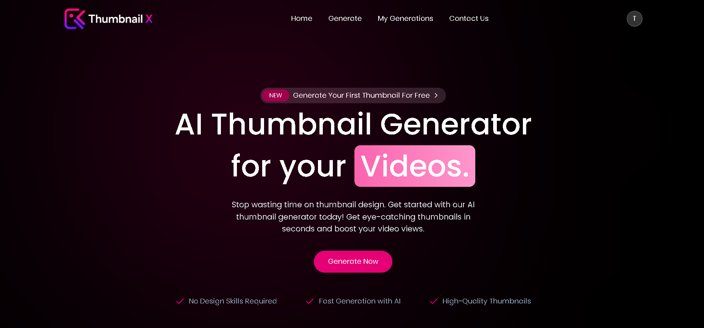
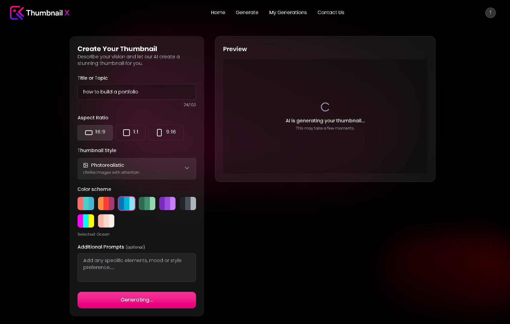

# 🎨 ThumbnailX - AI Thumbnail Generator

ThumbnailX is a full-stack AI-powered thumbnail generation platform that allows users to create eye-catching thumbnails from text prompts using AI. Users can securely sign up, log in, generate thumbnails, and manage all their generated content from a personalized dashboard.

## 🚀 Features

* 🤖 AI-powered thumbnail generation
* 📝 Generate thumbnails from text prompts
* 🔐 User authentication and session management
* 👤 Personalized user dashboard
* 🖼️ My Generations page
* 📱 Fully responsive design
* ⚡ Fast and modern UI
* ☁️ MongoDB database integration

## 🛠️ Tech Stack

### Frontend

* React.js
* TypeScript
* Tailwind CSS
* Axios
* React Router

### Backend

* Node.js
* Express.js
* TypeScript

### Database

* MongoDB
* Mongoose

### Authentication

* Express Session
* Connect Mongo Store

### AI Integration

* Gemini API

### Screenshots





## 📂 Project Structure

```bash
ThumbnailX/
│
├── client/
│   ├── src/
│   │   ├── assets/
│   │   ├── components/
│   │   ├── configs/
│   │   ├── context/
│   │   ├── data/
│   │   ├── pages/
│   │   ├── sections/
│   │   ├── App.tsx
│   │   ├── globals.css
│   │   ├── main.tsx
│   │   └── types.ts
│   │
│   ├── .env
│   ├── package.json
│   ├── vite.config.ts
│   └── vercel.json
│
├── server/
│   ├── configs/
│   ├── controllers/
│   ├── middlewares/
│   ├── models/
│   ├── routes/
│   ├── .env
│   ├── server.ts
│   ├── package.json
│   └── vercel.json
│
└── README.md
```


## ⚙️ Installation

### Clone Repository

```bash
git clone https://github.com/Shubham123-k/ThumbnailX.git
cd ThumbnailX
```

### Install Dependencies

Frontend

```bash
cd client
npm install
```

Backend

```bash
cd server
npm install
```

### Environment Variables

Create a `.env` file inside the server directory.

```env
PORT=3000

MONGODB_URI=your_mongodb_connection_string

SESSION_SECRET=your_session_secret

GEMINI_API_KEY=your_gemini_api_key
```

### Run Project

Backend

```bash
npm run sever
```

Frontend

```bash
npm run dev
```

## ✨ Key Learning Outcomes

* Full-Stack Web Development
* REST API Development
* Authentication & Authorization
* MongoDB Database Design
* Session-Based Authentication
* AI API Integration
* State Management in React
* Responsive UI Development

## 👨‍💻 Author

Shubham Bind

GitHub: https://github.com/Shubham123-k

LinkedIn: [www.linkedin.com/in/shubham-bind-9a31b4335](http://www.linkedin.com/in/shubham-bind-9a31b4335)
